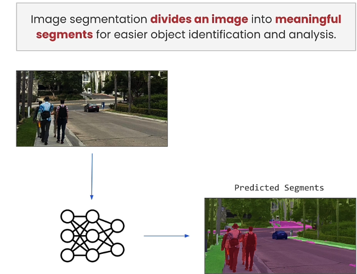
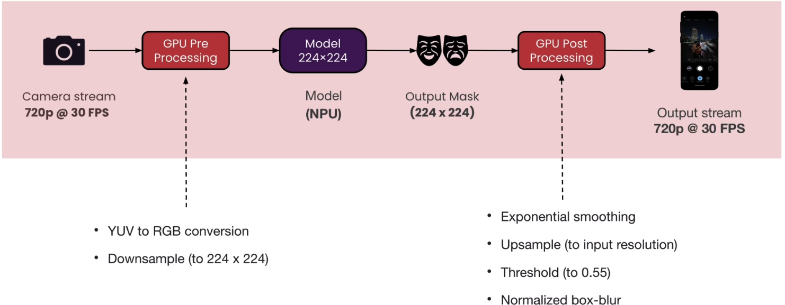

## Introduction

This repository contains all the `ipynb` files and supporting files used in the course.

## 笔记

### 一、为什么使用on-device AI

</img>

`on-device AI`有$4$个优势，它直接利用本地而不是依赖云端的计算资源，因此更**节约成本**；同时将数据直接存储在本地，保护了用户的**隐私**，并且不会将其转移到任何其它地方，得益于此，设备可直接在本地处理数据而不用发送到云端，执行也更加**高效**；在模型没有被外界数据的传输或更新的干扰下，它能创造更加**个性化**的用户体验。

### 二、部署步骤

</img>

首先把模型表示为一个计算图，然后为目标设备编译该计算图，之后在尝试部署到的设备上验证该模型的数值计算，并在设备上评估性能，最后部署到设备上，集成到应用中去。

### 三、图像分割

图像分割就是把一张图片划分成几个有意义的片段，用于更好的目标识别和分析。

### 四、设备集成

